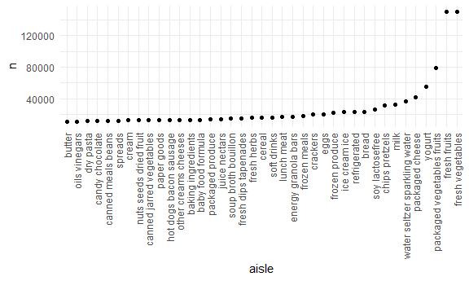

P8105 Homework 3
================
Chenxin Zhang
10/10/2020

## Probalem 1

This dataset contains 1384617 rows and 15 columns.

Observations are the level of items in orders by user. There are user /
order variables – user ID, order ID, order day, and order hour. There
are also item variables – name, aisle, department, and some numeric
codes.

How many aisles, and which are most items from?

    ## # A tibble: 134 x 2
    ##    aisle                              n
    ##    <chr>                          <int>
    ##  1 fresh vegetables              150609
    ##  2 fresh fruits                  150473
    ##  3 packaged vegetables fruits     78493
    ##  4 yogurt                         55240
    ##  5 packaged cheese                41699
    ##  6 water seltzer sparkling water  36617
    ##  7 milk                           32644
    ##  8 chips pretzels                 31269
    ##  9 soy lactosefree                26240
    ## 10 bread                          23635
    ## # ... with 124 more rows

Let’s make a plot

Let’s make a table\!\!

| aisle                      | product\_name                                 |    n | rank |
| :------------------------- | :-------------------------------------------- | ---: | ---: |
| baking ingredients         | Light Brown Sugar                             |  499 |    1 |
| baking ingredients         | Pure Baking Soda                              |  387 |    2 |
| baking ingredients         | Cane Sugar                                    |  336 |    3 |
| dog food care              | Snack Sticks Chicken & Rice Recipe Dog Treats |   30 |    1 |
| dog food care              | Organix Chicken & Brown Rice Recipe           |   28 |    2 |
| dog food care              | Small Dog Biscuits                            |   26 |    3 |
| packaged vegetables fruits | Organic Baby Spinach                          | 9784 |    1 |
| packaged vegetables fruits | Organic Raspberries                           | 5546 |    2 |
| packaged vegetables fruits | Organic Blueberries                           | 4966 |    3 |

Apples vs ice cream..

    ## # A tibble: 2 x 8
    ## # Groups:   product_name [2]
    ##   product_name       `0`   `1`   `2`   `3`   `4`   `5`   `6`
    ##   <chr>            <dbl> <dbl> <dbl> <dbl> <dbl> <dbl> <dbl>
    ## 1 Coffee Ice Cream  13.8  14.3  15.4  15.3  15.2  12.3  13.8
    ## 2 Pink Lady Apples  13.4  11.4  11.7  14.2  11.6  12.8  11.9

## Probalem 2

#### 2.1 Load, tidy, and otherwise wrangle the data

    ## # A tibble: 50,400 x 6
    ##    week  day_id day    minute ac_counts weekday_weekend
    ##    <fct> <fct>  <fct>   <int>     <dbl> <fct>          
    ##  1 1     1      Friday      1      88.4 weekday        
    ##  2 1     1      Friday      2      82.2 weekday        
    ##  3 1     1      Friday      3      64.4 weekday        
    ##  4 1     1      Friday      4      70.0 weekday        
    ##  5 1     1      Friday      5      75.0 weekday        
    ##  6 1     1      Friday      6      66.3 weekday        
    ##  7 1     1      Friday      7      53.8 weekday        
    ##  8 1     1      Friday      8      47.8 weekday        
    ##  9 1     1      Friday      9      55.5 weekday        
    ## 10 1     1      Friday     10      43.0 weekday        
    ## # ... with 50,390 more rows

  - This dataset includes 50400 rows and 6. It is consist of
    variabels：week, day\_id, day, minute, ac\_counts,
    weekday\_weekend.

#### 2.2 the total activity over the day

| week |    Monday |  Tuesday | Wednesday | Thursday |   Friday | Saturday | Sunday |  total\_week |
| :--- | --------: | -------: | --------: | -------: | -------: | -------: | -----: | -----------: |
| 1    |  78828.07 | 307094.2 |    340115 | 355923.6 | 480542.6 |   376254 | 631105 | 196039594401 |
| 2    | 295431.00 | 423245.0 |    440962 | 474048.0 | 568839.0 |   607175 | 422018 |  45410217006 |
| 3    | 685910.00 | 381507.0 |    468869 | 371230.0 | 467420.0 |   382928 | 467052 | 126168055179 |
| 4    | 409450.00 | 319568.0 |    434460 | 340291.0 | 154049.0 |     1440 | 260617 |  49864375939 |
| 5    | 389080.00 | 367824.0 |    445366 | 549658.0 | 620860.0 |     1440 | 138421 |  66111700330 |

\*The table shows that the men does less activities on weekend than on
weekdays.

#### 2.3 single-panel plot

  - As is shown in the graph, the men usually does activity frequently
    from 8am to 9pm in weekdays. During weekend, he has less activity
    time on Saturday, while much activity time in Sunday morning.

## Problem 3

#### 3.1 Data cleaning

|                                                  |              |
| :----------------------------------------------- | :----------- |
| Name                                             | ny\_noaa\_df |
| Number of rows                                   | 2595176      |
| Number of columns                                | 9            |
| \_\_\_\_\_\_\_\_\_\_\_\_\_\_\_\_\_\_\_\_\_\_\_   |              |
| Column type frequency:                           |              |
| character                                        | 1            |
| factor                                           | 3            |
| numeric                                          | 5            |
| \_\_\_\_\_\_\_\_\_\_\_\_\_\_\_\_\_\_\_\_\_\_\_\_ |              |
| Group variables                                  | None         |

Data summary

**Variable type: character**

| skim\_variable | n\_missing | complete\_rate | min | max | empty | n\_unique | whitespace |
| :------------- | ---------: | -------------: | --: | --: | ----: | --------: | ---------: |
| id             |          0 |              1 |  11 |  11 |     0 |       747 |          0 |

**Variable type: factor**

| skim\_variable | n\_missing | complete\_rate | ordered | n\_unique | top\_counts                                       |
| :------------- | ---------: | -------------: | :------ | --------: | :------------------------------------------------ |
| year           |          0 |              1 | FALSE   |        30 | 201: 159671, 200: 148721, 200: 122665, 200: 93249 |
| month          |          0 |              1 | FALSE   |        12 | 10: 224471, 12: 223603, 07: 220348, 08: 220100    |
| day            |          0 |              1 | FALSE   |        31 | 01: 85258, 02: 85258, 03: 85258, 04: 85258        |

**Variable type: numeric**

| skim\_variable | n\_missing | complete\_rate |  mean |     sd |     p0 |   p25 |  p50 |  p75 |  p100 |
| :------------- | ---------: | -------------: | ----: | -----: | -----: | ----: | ---: | ---: | ----: |
| prcp           |     145838 |           0.94 |  2.98 |   7.82 |    0.0 |   0.0 |  0.0 |  2.3 |  2286 |
| snow           |     381221 |           0.85 |  4.99 |  27.22 |    0.0 |   0.0 |  0.0 |  0.0 | 10160 |
| snwd           |     591786 |           0.77 | 37.31 | 113.54 |    0.0 |   0.0 |  0.0 |  0.0 |  9195 |
| tmax           |    1134358 |           0.56 | 13.98 |  11.14 | \-38.9 |   5.0 | 15.0 | 23.3 |    60 |
| tmin           |    1134420 |           0.56 |  3.03 |  10.40 | \-59.4 | \-3.9 |  3.3 | 11.1 |    60 |

    ## # A tibble: 281 x 4
    ##     snow na.rm       n  rank
    ##    <dbl> <lgl>   <int> <int>
    ##  1     0 TRUE  2008509     1
    ##  2     3 TRUE     8790    10
    ##  3     5 TRUE     9748     8
    ##  4     8 TRUE     9962     7
    ##  5    10 TRUE     5106    12
    ##  6    13 TRUE    23095     4
    ##  7    15 TRUE     3672    16
    ##  8    18 TRUE     3226    17
    ##  9    20 TRUE     4797    13
    ## 10    23 TRUE     1959    24
    ## # ... with 271 more rows

  - The dataset is consist of 2595176 rows and 9 columns. It contains
    variables: id, year, month, day, prcp, snow, snwd, tmax, tmin. For
    snowfall, the most commonly observed value is 0. As is shown in the
    snow\_df, there are 2,008,509 out of 2,595,176 days without snow,
    which rank 1.

#### 3.2 Average max temperature in January and in July

\*January outliers

| year | month | id          | avg\_tmax |
| :--- | :---- | :---------- | --------: |
| 1982 | 01    | USC00301723 |    \-13.4 |
| 1994 | 01    | USC00304996 |    \-10.6 |
| 1994 | 01    | USW00094725 |    \-10.2 |
| 1998 | 01    | USC00303464 |      10.2 |
| 2004 | 01    | USC00306957 |    \-10.8 |
| 2004 | 01    | USW00094725 |    \-10.4 |
| 2004 | 01    | USW00094740 |    \-10.4 |
| 2005 | 01    | USC00305925 |    \-12.2 |

\*July outliers

| year | month | id          | avg\_tmax |
| :--- | :---- | :---------- | --------: |
| 1984 | 07    | USC00308946 |      19.1 |
| 1988 | 07    | USC00308962 |      14.0 |
| 2000 | 07    | USC00306957 |      19.8 |
| 2000 | 07    | USC00308248 |      19.9 |
| 2004 | 07    | USC00302454 |      18.3 |
| 2007 | 07    | USC00309389 |      19.2 |
| 2010 | 07    | USC00305377 |      33.6 |

  - “The average max temperature in July in each station across years”
    shows that it is relatively low temperature in 1994,2004, and
    relatively high temperature in 1990,1995,1998,2002,2006. “The
    average max temperature in July in each station across years” shows
    that it is relatively low temperature in 1988,1992,2000 and
    relatively high temperature in 1983,1999,2010. According to the
    graph, we can easily see that average max temperature in both
    January and July over year are fluctuated. The temperature fluctuate
    between -13.4 to 10.2, while the temperature fluctuate between 14.0
    to 33.6.

#### 3.3

*plot showing tmax vs tmin for the full dataset *plot showing the
distribution of snowfall values greater than 0 and less than 100
separately by year

\*two-panel plot

  - The temp\_df shows that the maximum temperatures over years have a
    larger range between the Q1 to Q3 than the minimum temperature,
    according to the width of the box. However, the minimum temperatures
    over years have larger range from Q1 to Q4, as they have more
    outliers.
  - The snowfall\_df shows the values of snowfall concentrate on 0-25mm,
    50mm, 75mm. The fluctuation of snowfall over years are stable.
